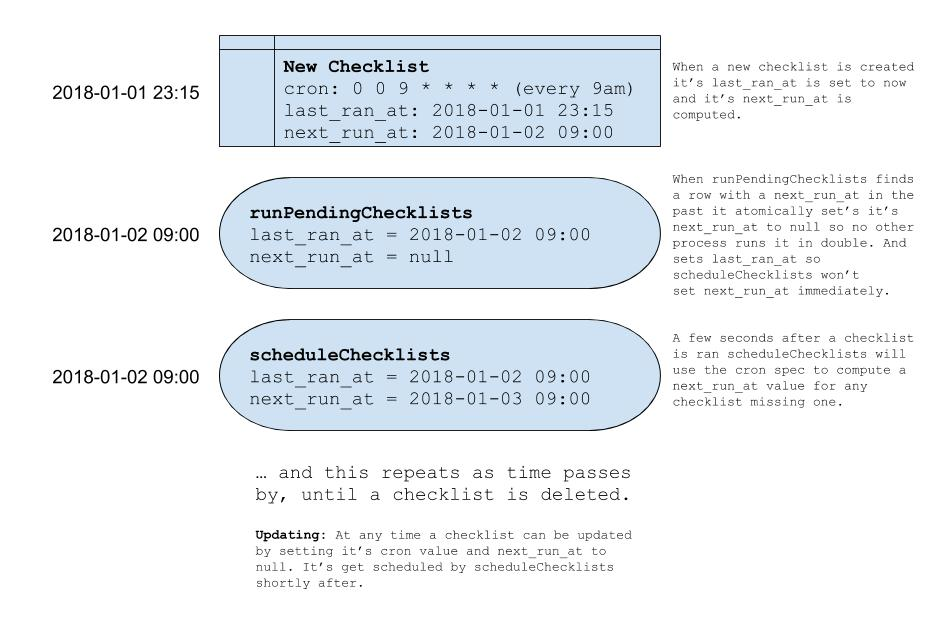

## Automated QA - Manager _(by LambdaGrid)_

### Documentation

The manager application takes care of persisting users's checklists and
resulting snapshots. It allows for running checklists and updating
snapshots when they fail / need changing.

**Endpoints**

method|path
-:|:-|
`POST`|`/api-keys`
`DELETE`|`/api-keys`
`GET`|`/checklists`
`POST`|`/checklists`
`PUT`|`/checklists/<id>`
`DELETE`|`/checklists/<id>`
`POST`|`/checklists/<id>/run`
`POST`|`/checklists/<id>/snapshots`
`GET`|`/schedules`
`POST`|`/schedules`
`PUT`|`/schedules/<id>`
`DELETE`|`/schedules/<id>`
`GET`|`/webhooks`
`POST`|`/webhooks`
`PUT`|`/webhooks/<id>`
`DELETE`|`/webhooks/<id>`

### Deploying

TBD

### Developing

**Setup**

First, make sure you have a recent version of `node` and `npm` installed
then, install the required dependecies using:

```
npm install
```

If this is the first time you are running this application make sure that
you have a local PostgreSQL server running and have access to the `psql`
utility. Next, run the following:

```
npm run dbsetup
```

If ever you want to clear your database and start with a blank slate, use:

```
npm run dbreset
```

**Running**

To run the application locally and try it out, make sure you've ran the
"setup" steps then use:

```
npm build
npm start
```

**Developing**

If you want make some changes to the code, you can run the application in
development mode so that the server is restarted when you make changes. Use:

```
npm run dev
```

**Testing**

Start by starting up the _dev_ server for all 3 applications:

- test-service
- worker
- manager

```
$ cd ../test-service
$ npm run dev
```

_(Make sure you've followed the instructions to setup the `test-service`'s
database & dependencies beforehand)_

and

```
$ cd ../worker
$ npm run dev
```

and

```
$ npm run dev
```

Now with both of those servers running on port `3000`, `3001` and `3002` you
should be able to run with success:

```
$ npm run test
```

### Running Linters

This project includes a `.prettierrc` file for your editor to use.

This project also has a TSLint configured which you can have your editor run
for you.

If you wish to run the lint checks from the command line you can use: `npm run lint`.

### Checklist Scheduling: How it works

One of the tasks the manager accomplishes is running checklists on a user
provided "cron" schedule. In order to accomplish this it uses 3 self-explanatory
fields on the checklist entity: `cron`, `last_ran_at`, `next_run_at`.

Delving deeper in how this works in practice, at startup time, 2 methods of the
`ScheduleService` are setup to be ran every second: `scheduleChecklists` and
`runPendingChecklists`.

**`runPendingChecklists`** will find any checklist that has a `next_run_at` in the
past and "run" it now. It also atomically sets the `next_run_at` to "null" so
that no other server/process picks up this checklist and tried to run it,
avoiding dounble runs (that PostgreSQL column act's as out "lock").

**`scheduleChecklists`** will look for any checklist with a "null" `next_run_at`
<sup>1</sup>, compute what the `next_run_at` should be and save it for
`runPendingChecklists` to use.

_[1] Making sure the last run was at least 1 second in the past to avoid
rescheduling a currently running task (cron's precision only goes to 1 second)_




### License

GPL-3.0. See `LICENSE.txt` file.
